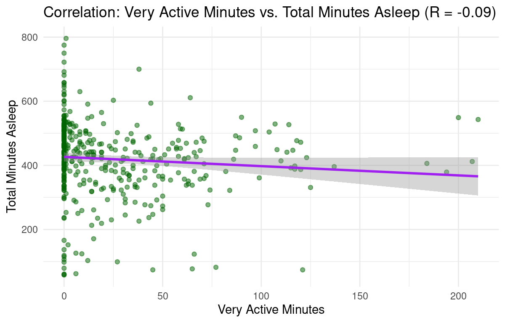

# Case Study: Bellabeat Wellness Technology Analysis (Google Data Analytics Capstone)

## Introduction

This case study analyzes Bellabeat’s wellness technology data using the six-step data analysis process — Ask, Prepare, Process, Analyze, Share, and Act — as part of the Google Data Analytics Capstone Project. The goal is to uncover actionable insights that inform Bellabeat’s marketing, product development, and user engagement strategies.

## Background

Founded in 2013, Bellabeat is a wellness technology company that develops smart, data-driven products designed to empower women to understand and optimize their health. The company's mission is to empower women with knowledge about their health and habits by collecting data on activity, sleep, stress, and reproductive health.

Bellabeat's product line includes:
- Bellabeat App: Provides health data on activity, sleep, stress, and more.
- Leaf: A versatile wellness tracker worn as a bracelet, necklace, or clip.
- Time: A wellness watch combining classic aesthetics with smart tracking.
- Spring: A smart water bottle that tracks daily water intake.
- Subscription Program: Offers personalized guidance on nutrition, activity, sleep, etc.

These smart products integrate seamlessly to provide women with comprehensive, data-driven insights into their daily wellness habits.

## Scenario

In this hypothetical case study, I am working as a Junior Data Analyst on the marketing team at Bellabeat. My objective is to translate data insights into actionable strategies that help the Bellabeat executive team improve user engagement and growth. This report will specifically include a clear articulation of the business task, a description of the data utilized, documentation of all cleaning and manipulation processes, a summary of the analysis, supporting visualizations, and top-tier, actionable recommendations based on the insights.

## Step 1: Ask

The business task is to analyze external consumer data from non-Bellabeat smart devices (specifically Fitbit data) to identify behavioral trends in activity, engagement, and sleep.

By identifying key behavioral trends—such as reduced activity on Sundays and a mid-afternoon (3 PM) engagement lull—and by exploring correlations (e.g., sedentary time versus total sleep), I will develop data-driven recommendations to increase user engagement and growth across Bellabeat’s product ecosystem.

## Step 2: Prepare

### Data Integrity Check (ROCCC)

To ensure transparency and qualify the validity of the analysis, the public dataset was evaluated against the ROCCC framework (Reliable, Original, Comprehensive, Current, and Cited).

The data for this project is a public dataset sourced from Kaggle (Mobius user profile). It was generated from responses to a survey conducted via Amazon Mechanical Turk and contains personal health data from 33 consensual Fitbit users, spanning metrics like daily activity, steps, heart rate, and sleep monitoring.

Applying the ROCCC framework:

- Reliable: Low — only 33 distinct users, limiting representativeness.
- Original: Low — third-party dataset collected via Amazon Mechanical Turk.
- Comprehensive: Low — lacks demographic information (e.g., gender, age, health conditions) and focuses mainly on activity, calories, and sleep data.
- Current: Low — data is approximately nine years old.
- Cited: Low — obtained from an unverified third-party source (Amazon Mechanical Turk).

Despite these limitations, the dataset remains useful for identifying broad behavioral trends that can serve as directional insights for Bellabeat’s future strategies.

### Preparing RStudio

To start the analysis, the following packages—tidyverse (for data manipulation and visualization), janitor (for cleaning), and lubridate (for date formatting) were installed and activated in R. Four separate raw data files were then imported as data frames.

```r
install.packages("tidyverse")
install.packages("janitor")
install.packages("lubridate")

library(tidyverse)
library(janitor) 
library(lubridate)

daily_activity <- read_csv("dailyActivity_merged.csv")
daily_sleep <- read_csv("sleepDay_merged.csv")
hourly_steps <- read_csv("hourlySteps_merged.csv")
hourly_calories <- read_csv("hourlyCalories_merged.csv")
```

## Step 3: Process

### Data Cleaning 

The four raw datasets were cleaned to ensure consistency for merging. This included standardizing column names (to snake_case), removing duplicates, converting the user ID column to a character format for joining, standardizing date/time fields, and removing unnecessary columns (distance and duplicate sleep record fields).

```r
daily_activity_clean <- daily_activity %>%
  clean_names() %>%
  distinct() %>%
  mutate(id = as.character(id)) %>%
  rename(date = activity_date) %>%
  mutate(date = mdy(date)) %>%
  select(-tracker_distance, -logged_activities_distance, -sedentary_active_distance)

daily_sleep_clean <- daily_sleep %>%
  clean_names() %>%
  distinct() %>%
  mutate(id = as.character(id)) %>%
  rename(date = sleep_day) %>%
  mutate(date = as_date(mdy_hms(date))) %>%
  select(-total_sleep_records)

hourly_steps_clean <- hourly_steps %>%
  clean_names() %>%
  mutate(id = as.character(id)) %>%
  mutate(
    activity_hour = mdy_hms(activity_hour),
    hour = hour(activity_hour) 
  )

hourly_calories_clean <- hourly_calories %>%
  clean_names() %>%
  mutate(id = as.character(id)) %>%
  mutate(
    activity_hour = mdy_hms(activity_hour),
    hour = hour(activity_hour)
  )
```

### Data Merging

The cleaned daily and hourly datasets were combined into two comprehensive tables using a full_join().

```r
daily_combined <- full_join(
  daily_activity_clean,
  daily_sleep_clean,
  by = c("id", "date")
)

hourly_combined <- full_join(
  hourly_steps_clean,
  hourly_calories_clean,
  by = c("id", "activity_hour", "hour")
)
```

### Adding Columns

Two calculated columns were added to the combined datasets to enhance analysis capability:

- Day of the Week: Added to both datasets for time-based analysis.
- Total Active Minutes: A consolidated metric added to the daily dataset to simplify activity level analysis.

```r
daily_combined <- daily_combined %>%
  mutate(
    day_of_week = lubridate::wday(date, label = TRUE, abbr = FALSE)
  )

hourly_combined <- hourly_combined %>%
  mutate(
    day_of_week = lubridate::wday(activity_hour, label = TRUE, abbr = FALSE)
  )
```

A total_active_minutes column was added to the daily dataset to consolidate overall activity metrics.

```r
daily_combined <- daily_combined %>%
  mutate(
    total_active_minutes = very_active_minutes + fairly_active_minutes + lightly_active_minutes
  )
```

## Step 4: Analyze

### Descriptive Statistics 

Before correlation and time-series analysis, key descriptive statistics were generated to establish a baseline of the typical smart device user's habits.

#### Summary of Key Daily Metrics 

| Average_Steps 	| Average_Sleep_Min 	| Average_Sedentary_Min 	| Average_Calories 	| Average_Activity 	|
|---------------	|-------------------	|-----------------------	|------------------	|------------------	|
| 7637.911      	| 419.1732          	| 991.2106              	| 2303.61          	| 227.5426         	|

On average, users walked 7,638 steps, burned 2,304 calories, and slept for approximately 7 hours (419 minutes) per day. However, they spent a highly concerning 16.5 hours (991 minutes) sedentary—indicating a largely inactive lifestyle and a clear opportunity for Bellabeat to promote regular movement habits. This baseline data highlights the imbalance between physical activity and sedentary time, a key target for Bellabeat’s behavioral engagement initiatives.

### Correlation Analysis

Pearson correlation coefficient (r) was calculated between six different pairs of metrics from the daily_combined data frame to understand the linear relationships between activity metrics, calories burned, and sleep duration. A dataframe summary was then created for the analysis. 

```r
correlations <- list(
  "Total Steps vs Calories" = cor(daily_combined$total_steps, daily_combined$calories, use = "complete.obs"),
  "Total Steps vs Sleep" = cor(daily_combined$total_steps, daily_combined$total_minutes_asleep, use = "complete.obs"),
  "Sedentary Minutes vs Sleep" = cor(daily_combined$sedentary_minutes, daily_combined$total_minutes_asleep, use = "complete.obs"),
  "Lightly Active Minutes vs Sleep" = cor(daily_combined$lightly_active_minutes, daily_combined$total_minutes_asleep, use = "complete.obs"),
  "Fairly Active Minutes vs Sleep" = cor(daily_combined$fairly_active_minutes, daily_combined$total_minutes_asleep, use = "complete.obs"),
  "Very Active Minutes vs Sleep" = cor(daily_combined$very_active_minutes, daily_combined$total_minutes_asleep, use = "complete.obs")
)

correlation_summary <- tibble::tibble(
  Metric_Pair = names(correlations),
  r = round(unlist(correlations), 2)
)
```

The correlation analysis reveals several key relationships seen below. As expected, there is a moderate positive correlation (r=0.59) between Total Steps and Calories Burned, confirming that increased movement leads to higher energy expenditure. The most significant finding, however, is the moderate negative correlation (r=−0.60) between Sedentary Minutes and Total Minutes Asleep. This strong relationship indicates that the more time users spend being inactive or sitting, the less total sleep they tend to get, suggesting that reducing sedentary time is a primary factor in improving sleep. Conversely, all other active minutes categories (lightly, fairly, and very active) showed only negligible or weak negative correlations with sleep duration, underscoring that the negative impact of inactivity is a stronger driver of poor sleep than the positive impact of activity is a driver of good sleep.

### Correlation Summary Table

| Metric_Pair                     	| r     	|
|---------------------------------	|-------	|
| Total Steps vs Calories         	| 0.59  	|
| Total Steps vs Sleep            	| -0.19 	|
| Sedentary Minutes vs Sleep      	| -0.60 	|
| Lightly Active Minutes vs Sleep 	| 0.03  	|
| Fairly Active Minutes vs Sleep  	| -0.25 	|
| Very Active Minutes vs Sleep    	| -0.09 	|

## Step 5: Share

### Average Steps by Day of Week

```r
daily_combined %>%
  group_by(day_of_week) %>%
  summarise(average_steps = mean(total_steps, na.rm = TRUE)) %>%
  ggplot(aes(x = day_of_week, y = average_steps)) +
  geom_bar(stat = "identity", fill = "blue") +
  labs(
    title = "Average Steps by Day of the Week",
    x = "Day of the Week",
    y = "Average Steps"
  ) +
  theme_minimal()
```

The graph below shows that average steps are highest during the Monday-Saturday window and lowest on Sunday. This suggests users prioritize tracking activity during the work week and on the main leisure day.


### Average Steps by Hour of Day

This bar chart pinpoints the peak times of day for user activity.

```r
hourly_combined %>%
  group_by(hour) %>%
  summarise(average_steps = mean(step_total, na.rm = TRUE)) %>%
  ggplot(aes(x = hour, y = average_steps)) +
  geom_bar(stat = "identity", fill = "coral") +
  labs(
    title = "Average Steps by Hour of the Day",
    x = "Hour of the Day (0-23)",
    y = "Average Steps"
  ) +
  theme_minimal()
```

The graph below shows that users exhibit two distinct peak activity windows: 12 PM - 2 PM (Lunchtime) and 5 PM - 7 PM (Post-Work/Evening). There is also a noticeable dip around 3 PM. 


### Correlation Between Total Steps and Calories

```r
daily_combined %>%
  ggplot(aes(x = total_steps, y = calories)) +
  geom_point(alpha = 0.5, color = "darkgreen") +
  geom_smooth(method = "lm", color = "red") +
  labs(
    title = paste0("Correlation: Daily Steps vs. Calories Burned (R = ", 
                   correlation_summary %>% filter(Metric_Pair == "Total Steps vs Calories") %>% pull(r), 
                   ")"),
    x = "Total Steps",
    y = "Calories Burned"
  ) +
  theme_minimal()
```

The graph below shows a moderate positive correlation (R=0.59) between total steps and calories burned. This is an expected relationship, indicating that the more steps a user takes, the more likely they are to burn more calories.


### Correlation Between Total Steps and Total Minutes Asleep

```r
daily_combined %>%
  filter(!is.na(total_minutes_asleep)) %>%
  ggplot(aes(x = total_steps, y = total_minutes_asleep)) +
  geom_point(alpha = 0.5, color = "darkred") +
  geom_smooth(method = "lm", color = "blue") +
  labs(
    title = paste0("Correlation: Total Steps vs. Total Minutes Asleep (R = ", 
                   correlation_summary %>% filter(Metric_Pair == "Total Steps vs Sleep") %>% pull(r), 
                   ")"),
    x = "Total Steps",
    y = "Total Minutes Asleep"
  ) +
  theme_minimal()
```

The graph below shows a negligible negative correlation (R=−0.19) between total steps and minutes asleep. This suggests that the overall number of steps a user takes does not significantly impact their total sleep duration.


### Correlation Between Sedentary Minutes and Total Minutes Asleep

```r
daily_combined %>%
  filter(!is.na(total_minutes_asleep)) %>%
  ggplot(aes(x = sedentary_minutes, y = total_minutes_asleep)) +
  geom_point(alpha = 0.5, color = "purple") +
  geom_smooth(method = "lm", color = "green") +
  labs(
    title = paste0("Correlation: Sedentary Minutes vs. Total Minutes Asleep (R = ", 
                   correlation_summary %>% filter(Metric_Pair == "Sedentary Minutes vs Sleep") %>% pull(r), 
                   ")"),
    x = "Sedentary Minutes",
    y = "Total Minutes Asleep"
  ) +
  theme_minimal()
```

The graph below shows a moderate negative correlation (R=−0.60) between sedentary minutes and minutes asleep. This is a significant finding, indicating that people who spend more time being sedentary tend to get less sleep.


### Correlation Between Lightly Active Minutes and Total Minutes Asleep

```r
daily_combined %>%
  filter(!is.na(total_minutes_asleep)) %>%
  ggplot(aes(x = lightly_active_minutes, y = total_minutes_asleep)) +
  geom_point(alpha = 0.5, color = "orange") +
  geom_smooth(method = "lm", color = "black") +
  labs(
    title = paste0("Correlation: Lightly Active Minutes vs. Total Minutes Asleep (R = ", 
                   correlation_summary %>% filter(Metric_Pair == "Lightly Active Minutes vs Sleep") %>% pull(r), 
                   ")"),
    x = "Lightly Active Minutes",
    y = "Total Minutes Asleep"
  ) +
  theme_minimal()
```

The graph below shows a negligible positive correlation (R=0.03). This indicates that time spent in light activity (e.g., casual walking) has virtually no effect on the minutes a user sleeps.


### Correlation Between Fairly Active Minutes and Total Minutes Asleep

```r
daily_combined %>%
  filter(!is.na(total_minutes_asleep)) %>%
  ggplot(aes(x = fairly_active_minutes, y = total_minutes_asleep)) +
  geom_point(alpha = 0.5, color = "brown") +
  geom_smooth(method = "lm", color = "red") +
  labs(
    title = paste0("Correlation: Fairly Active Minutes vs. Total Minutes Asleep (R = ", 
                   correlation_summary %>% filter(Metric_Pair == "Fairly Active Minutes vs Sleep") %>% pull(r), 
                   ")"),
    x = "Fairly Active Minutes",
    y = "Total Minutes Asleep"
  ) +
  theme_minimal()
```

The graph below shows a weak negative correlation (R=−0.25). This suggests that a moderate amount of activity does not have a strong impact on a user's total sleep duration.


### Correlation Between Very Active Minutes and Total Minutes Asleep

```r
daily_combined %>%
  filter(!is.na(total_minutes_asleep)) %>%
  ggplot(aes(x = very_active_minutes, y = total_minutes_asleep)) +
  geom_point(alpha = 0.5, color = "darkgreen") +
  geom_smooth(method = "lm", color = "purple") +
  labs(
    title = paste0("Correlation: Very Active Minutes vs. Total Minutes Asleep (R = ", 
                   correlation_summary %>% filter(Metric_Pair == "Very Active Minutes vs Sleep") %>% pull(r), 
                   ")"),
    x = "Very Active Minutes",
    y = "Total Minutes Asleep"
  ) +
  theme_minimal()
```

The graph below shows a negligible negative correlation (R=−0.09). This indicates that time spent in high-intensity activity, similar to other active metrics, does not strongly affect the minutes a user sleeps.



## Step 6: Act

### Recommendations

1. "Anti-Sedentary" Campaign for Sleep
   - The strongest data-driven finding is the moderate negative correlation (R=−0.60) between sedentary minutes and total minutes asleep, indicating that prolonged inactivity is the primary barrier to optimal sleep. To leverage this, Bellabeat should update the Leaf/Time firmware and Bellabeat App to track and provide targeted intervention. The system should alert the user when they have been sedentary for more than 90 continuous minutes, a period chosen to interrupt the population's high average of approximately 16.5 hours of sedentary time. The messaging for this push notification must focus on the benefit of rest, using a compelling phrase like: "A 5-minute movement break now is an investment in your sleep tonight. Improve your Leaf/Time sleep score!" This directly connects product usage to the health outcome the user desires.
     
2. Target the 3 PM Engagement Lull
   - Analysis of hourly steps reveals a significant drop-off in user engagement around 3 PM, creating a major opportunity for retention and momentum. To counteract this mid-afternoon slump, Bellabeat should launch a highly achievable "3-Minute-3 PM Challenge" within the Bellabeat App. This micro-challenge, which could involve a goal like 200 steps or a minute of stretching, is designed to be completed quickly and provide positive reinforcement. Furthermore, this initiative is an ideal point for product integration with the Spring smart water bottle; the post-challenge notification should prompt: "Challenge completed! Now log your hydration with Spring to sustain momentum into the 5 PM peak," successfully cross-promoting two products and encouraging all-day habit stacking.
     
3. Mitigate the Weekend Activity Dip
   - The data shows that user activity drops significantly on Sunday, which increases the likelihood of long-term disengagement from wellness habits. Instead of pushing intense step goals, the strategy for the weekend must shift to promoting holistic consistency. We recommend launching a "Self-Care Sunday" initiative that focuses on utilizing the Subscription Program features. This challenge should prioritize low-impact, high-value activities such as logging a guided meditation, accurately tracking sleep data with Leaf/Time, or completing a light activity goal (e.g., 30 minutes of gentle walking). This maintains a continuous daily routine, ensuring users interact with the Bellabeat ecosystem across all seven days.
   


