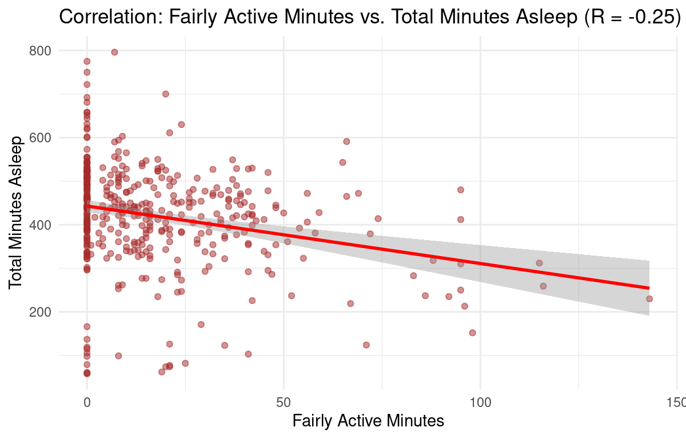

# Case Study: Bellabeat Wellness Technology Analysis (Google Data Analytics Capstone)

## Introduction

This document presents the analysis for the Bellabeat Wellness Technology Case Study, the capstone project for the Google Data Analytics Professional Certificate. The project follows the six-step data analysis process: Ask, Prepare, Process, Analyze, Share, and Act, to address key business objectives for Bellabeat's growth.

## Background

Bellabeat is a high-tech company, founded in 2013, focused on manufacturing health and wellness products specifically for women. The company's mission is to empower women with knowledge about their health and habits by collecting data on activity, sleep, stress, and reproductive health.

Bellabeat's product line includes:
- Bellabeat App: Provides health data on activity, sleep, stress, and more.
- Leaf: A versatile wellness tracker worn as a bracelet, necklace, or clip.
- Time: A wellness watch combining classic aesthetics with smart tracking.
- Spring: A smart water bottle that tracks daily water intake.
- Subscription Program: Offers personalized guidance on nutrition, activity, sleep, etc.

These smart products are designed to interact seamlessly with one another to provide comprehensive, data-driven insights to the user.

## Scenario

In this hypothetical case study, I am working as a Junior Data Analyst on the marketing team at Bellabeat. My primary objective is to present data-driven findings and strategic solutions to the Bellabeat executive team. This report will specifically include a clear articulation of the business task, a description of the data utilized, documentation of all cleaning and manipulation processes, a summary of the analysis, supporting visualizations, and top-tier, actionable recommendations based on the insights.

## Step 1: Ask

The business task is to analyze external consumer data on non-Bellabeat smart devices (specifically Fitbit data) to gain critical insights into user behavior and engagement patterns.

By identifying key trends in activity, sleep, and caloric expenditure among typical smart device users, I will provide data-driven recommendations to the Bellabeat executive team on how to optimize marketing strategies for their products (Leaf, Time, Spring, App) to increase user engagement and drive sustainable business growth.

## Step 2: Prepare

### Data Integrity Check (ROCCC)

To ensure transparency and qualify the validity of the analysis, the public dataset was evaluated against the ROCCC framework (Reliable, Original, Comprehensive, Current, and Cited).

The data for this project is a public dataset sourced from Kaggle (Mobius user profile). It was generated from responses to a survey conducted via Amazon Mechanical Turk and contains personal health data from 33 consensual Fitbit users, spanning metrics like daily activity, steps, heart rate, and sleep monitoring.

Applying the ROCCC framework:

- Reliable: Low due to only 33 disitnct users being a small sample size. 
- Original: Low due the data being provided from a third party data provider (Amazon Mechanical Turk).
- Comprehensive: Low due to The dataset lacks crucial demographic information (e.g., gender, age, health conditions) and only focuses on activity, calories, and sleep.
- Current: Low due to the data being approximatley 9 years ago.
- Cited: Low due to the fact that it has been obtained from an unidentified third partyu source (Amazon Mechanical Turk).

### Preparing RStudio

To start the analysis, the following packages—tidyverse (for data manipulation and visualization), janitor (for cleaning), and lubridate (for date formatting) were installed and activated in R. Four separate raw data files were then imported as data frames.

```r
install.packages("tidyverse")
install.packages("janitor")
install.packages("lubridate")

library(tidyverse)
library(janitor) 
library(lubridate)

daily_activity <- read_csv("dailyActivity_merged.csv")
daily_sleep <- read_csv("sleepDay_merged.csv")
hourly_steps <- read_csv("hourlySteps_merged.csv")
hourly_calories <- read_csv("hourlyCalories_merged.csv")
```

## Step 3: Process

### Data Cleaning 

The four raw datasets were cleaned to ensure consistency for merging. This included standardizing column names (to snake_case), removing duplicates, converting the user ID column to a character format for joining, standardizing date/time fields, and removing unecessary columns (distance and sleep records).

```r
daily_activity_clean <- daily_activity %>%
  clean_names() %>%
  distinct() %>%
  mutate(id = as.character(id)) %>%
  rename(date = activity_date) %>%
  mutate(date = mdy(date)) %>%
  select(-tracker_distance, -logged_activities_distance, -sedentary_active_distance)

daily_sleep_clean <- daily_sleep %>%
  clean_names() %>%
  distinct() %>%
  mutate(id = as.character(id)) %>%
  rename(date = sleep_day) %>%
  mutate(date = as_date(mdy_hms(date))) %>%
  select(-total_sleep_records)

hourly_steps_clean <- hourly_steps %>%
  clean_names() %>%
  mutate(id = as.character(id)) %>%
  mutate(
    activity_hour = mdy_hms(activity_hour),
    hour = hour(activity_hour) 
  )

hourly_calories_clean <- hourly_calories %>%
  clean_names() %>%
  mutate(id = as.character(id)) %>%
  mutate(
    activity_hour = mdy_hms(activity_hour),
    hour = hour(activity_hour)
  )
```

### Data Merging

The cleaned daily and hourly datasets were combined into two comprehensive tables using an R full_join().

```r
daily_combined <- full_join(
  daily_activity_clean,
  daily_sleep_clean,
  by = c("id", "date")
)

hourly_combined <- full_join(
  hourly_steps_clean,
  hourly_calories_clean,
  by = c("id", "activity_hour", "hour")
)
```

### Adding Columns

Two calculated columns were added to the combined datasets to enhance analysis capability:

- Day of the Week: Added to both datasets for time-based analysis.
- Total Active Minutes: A consolidated metric added to the daily dataset to simplify activity level analysis.

```r
daily_combined <- daily_combined %>%
  mutate(
    day_of_week = lubridate::wday(date, label = TRUE, abbr = FALSE)
  )

hourly_combined <- hourly_combined %>%
  mutate(
    day_of_week = lubridate::wday(activity_hour, label = TRUE, abbr = FALSE)
  )
```

A total active minutes column to only the daily combined dataset.

```r
daily_combined <- daily_combined %>%
  mutate(
    total_active_minutes = very_active_minutes + fairly_active_minutes + lightly_active_minutes
  )
```

## Step 4: Analyze

### Graphing Average Steps by Day of Week

This bar chart reveals weekly step patterns, highlighting when users are most and least active.

```r
daily_combined %>%
  group_by(day_of_week) %>%
  summarise(average_steps = mean(total_steps, na.rm = TRUE)) %>%
  ggplot(aes(x = day_of_week, y = average_steps)) +
  geom_bar(stat = "identity", fill = "blue") +
  labs(
    title = "Average Steps by Day of the Week",
    x = "Day of the Week",
    y = "Average Steps"
  ) +
  theme_minimal()
```

### Graphing Average Steps by Hour of Day

This bar chart pinpoints the peak times of day for user activity.

```r
hourly_combined %>%
  group_by(hour) %>%
  summarise(average_steps = mean(step_total, na.rm = TRUE)) %>%
  ggplot(aes(x = hour, y = average_steps)) +
  geom_bar(stat = "identity", fill = "coral") +
  labs(
    title = "Average Steps by Hour of the Day",
    x = "Hour of the Day (0-23)",
    y = "Average Steps"
  ) +
  theme_minimal()
```
## Correlation Analysis

Pearson correlation coefficients (r) were calculated and visualized to understand the linear relationships between activity metrics, calories burned, and sleep duration.

### Total steps vs calories burned

```r
r_steps_calories <- daily_combined %>%
  filter(!is.na(total_steps) & !is.na(calories)) %>%
  summarise(r = cor(total_steps, calories)) %>%
  pull(r)
r_steps_calories <- round(r_steps_calories, 2)

daily_combined %>%
  ggplot(aes(x = total_steps, y = calories)) +
  geom_point(alpha = 0.5, color = "darkgreen") +
  geom_smooth(method = "lm", color = "red") +
  labs(
    title = paste0("Correlation: Daily Steps vs. Calories Burned (R = ", r_steps_calories, ")"),
    x = "Total Steps",
    y = "Calories Burned"
  ) +
  theme_minimal()
```

### Total steps vs Total minutes asleep

```r
r_steps_sleep <- daily_combined %>%
  filter(!is.na(total_minutes_asleep)) %>%
  summarise(r = cor(total_steps, total_minutes_asleep)) %>%
  pull(r)
r_steps_sleep <- round(r_steps_sleep, 2)

daily_combined %>%
  filter(!is.na(total_minutes_asleep)) %>%
  ggplot(aes(x = total_steps, y = total_minutes_asleep)) +
  geom_point(alpha = 0.5, color = "darkred") +
  geom_smooth(method = "lm", color = "blue") +
  labs(
    title = paste0("Correlation: Total Steps vs. Total Minutes Asleep (R = ", r_steps_sleep, ")"),
    x = "Total Steps",
    y = "Total Minutes Asleep"
  ) +
  theme_minimal()
```

### Sedentary minutes vs total minutes asleep

```r
r_sedentary_sleep <- daily_combined %>%
  filter(!is.na(total_minutes_asleep)) %>%
  summarise(r = cor(sedentary_minutes, total_minutes_asleep)) %>%
  pull(r)
r_sedentary_sleep <- round(r_sedentary_sleep, 2)

daily_combined %>%
  filter(!is.na(total_minutes_asleep)) %>%
  ggplot(aes(x = sedentary_minutes, y = total_minutes_asleep)) +
  geom_point(alpha = 0.5, color = "purple") +
  geom_smooth(method = "lm", color = "green") +
  labs(
    title = paste0("Correlation: Sedentary Minutes vs. Total Minutes Asleep (R = ", r_sedentary_sleep, ")"),
    x = "Sedentary Minutes",
    y = "Total Minutes Asleep"
  ) +
  theme_minimal()
```

### Lightly active minutes vs total minutes asleep

```r
r_lightly_sleep <- daily_combined %>%
  filter(!is.na(total_minutes_asleep)) %>%
  summarise(r = cor(lightly_active_minutes, total_minutes_asleep)) %>%
  pull(r)
r_lightly_sleep <- round(r_lightly_sleep, 2)

daily_combined %>%
  filter(!is.na(total_minutes_asleep)) %>%
  ggplot(aes(x = lightly_active_minutes, y = total_minutes_asleep)) +
  geom_point(alpha = 0.5, color = "orange") +
  geom_smooth(method = "lm", color = "black") +
  labs(
    title = paste0("Correlation: Lightly Active Minutes vs. Total Minutes Asleep (R = ", r_lightly_sleep, ")"),
    x = "Lightly Active Minutes",
    y = "Total Minutes Asleep"
  ) +
  theme_minimal()
```

### Fairly active minutes vs total minutes asleep

```r
r_fairly_sleep <- daily_combined %>%
  filter(!is.na(total_minutes_asleep)) %>%
  summarise(r = cor(fairly_active_minutes, total_minutes_asleep)) %>%
  pull(r)
r_fairly_sleep <- round(r_fairly_sleep, 2)

daily_combined %>%
  filter(!is.na(total_minutes_asleep)) %>%
  ggplot(aes(x = fairly_active_minutes, y = total_minutes_asleep)) +
  geom_point(alpha = 0.5, color = "brown") +
  geom_smooth(method = "lm", color = "red") +
  labs(
    title = paste0("Correlation: Fairly Active Minutes vs. Total Minutes Asleep (R = ", r_fairly_sleep, ")"),
    x = "Fairly Active Minutes",
    y = "Total Minutes Asleep"
  ) +
  theme_minimal()
```

### Vry active minutes vs total minutes asleep

```r
r_very_sleep <- daily_combined %>%
  filter(!is.na(total_minutes_asleep)) %>%
  summarise(r = cor(very_active_minutes, total_minutes_asleep)) %>%
  pull(r)
r_very_sleep <- round(r_very_sleep, 2)

daily_combined %>%
  filter(!is.na(total_minutes_asleep)) %>%
  ggplot(aes(x = very_active_minutes, y = total_minutes_asleep)) +
  geom_point(alpha = 0.5, color = "darkgreen") +
  geom_smooth(method = "lm", color = "purple") +
  labs(
    title = paste0("Correlation: Very Active Minutes vs. Total Minutes Asleep (R = ", r_very_sleep, ")"),
    x = "Very Active Minutes",
    y = "Total Minutes Asleep"
  ) +
  theme_minimal()
```

## Step 5: Share

### Average Steps by Day of Week

The graph below shows that average steps are highest during the Monday-Saturday window and lowest on Sunday. This suggests users prioritize tracking activity during the work week and on the main leisure day.


### Average Steps by Hour of Day

The graph below shows that users exhibit two distinct peak activity windows: 12 PM - 2 PM (Lunchtime) and 5 PM - 7 PM (Post-Work/Evening). There is also a noticeable dip around 3 PM. 


### Correlation betwen total steps and calories

The graph below shows a moderate positive correlation (R=0.59) between total steps and calories burned. This is an expected relationship, indicating that the more steps a user takes, the more likely they are to burn more calories.


### Correlation betwen total steps and total minutes asleep

The graph below shows a negligible negative correlation (R=−0.19) between total steps and minutes asleep. This suggests that the overall number of steps a user takes does not significantly impact their total sleep duration.


### Correlation betwen sedentary minutes and total minutes asleep

The graph below shows a moderate negative correlation (R=−0.60) between sedentary minutes and minutes asleep. This is a significant finding, indicating that people who spend more time being sedentary tend to get less sleep.


### Correlation betwen lightly active minutes and total minutes asleep

The graph below shows a negligible positive correlation (R=0.03). This indicates that time spent in light activity (e.g., casual walking) has virtually no effect on the minutes a user sleeps.


### Correlation betwen fairly active minutes and total minutes asleep

The graph below shows a weak negative correlation (R=−0.25). This suggests that a moderate amount of activity does not have a strong impact on a user's total sleep duration.



### Correlation between very active minutes and total minutes asleep

The graph below shows a negligible negative correlation (R=−0.09). This indicates that time spent in high-intensity activity, similar to other active metrics, does not strongly affect the minutes a user sleeps.


## Step 6: Act

### Reccomendations

1. "Anti-Sedentary" Campaign for Sleep
   - There strong negative correlation (R=−0.60) between sedentary minutes and total minutes asleep indicating that people who spend more time being sedentary tend to get less sleep. Bellabeat should create an "Anti Sedentary" campaign that provides in app alerts to break up long periods of activity that are linked to deteroriated sleep. The leaf or time products can track these periods and send alerts to the Bellabeat app when sednetary minutes exceed one hour. The message should be framed around restorative sleep ("A 5-minute movement break now is an investment in your sleep tonight."). 
2. Target the 3 PM Engagement Lull
   - The drop-off in steps around 3 PM indicates a loss of user engagement during the mid-afternoon slump. Re-engaging users at this point can significantly lift daily activity and retention. Bellabeat should launch in-app reminders to maintain their activity. Introduce a "3-Minute-3 PM Challenge" within the App. This micro-challenge is a highly achievable goal (e.g., 200 steps or one minute of stretching) designed to break the afternoon slump and drive the user back to the App for positive reinforcement (a small badge, a point reward, etc.). This helps sustain momentum into the high-activity 5 PM - 7 PM window.
3. Mitigate the Weekend Activity Dip
   - Activity drops significantly on Sunday, suggesting users pause their tracking/wellness habits, which increases the likelihood of disengagement. Maintaining a routine across all seven days is key to long-term habit formation. Bellabeat should launch the "Seven-Day Streak" or "Self-Care Sunday" initiative focused on consistency, not intensity. Instead of focusing on steps, these challenges should emphasize utilization of other Bellabeat features (e.g., logging hydration with Spring, tracking a guided meditation through the Subscription Program, or simply logging sleep data with Leaf/Time).
   


